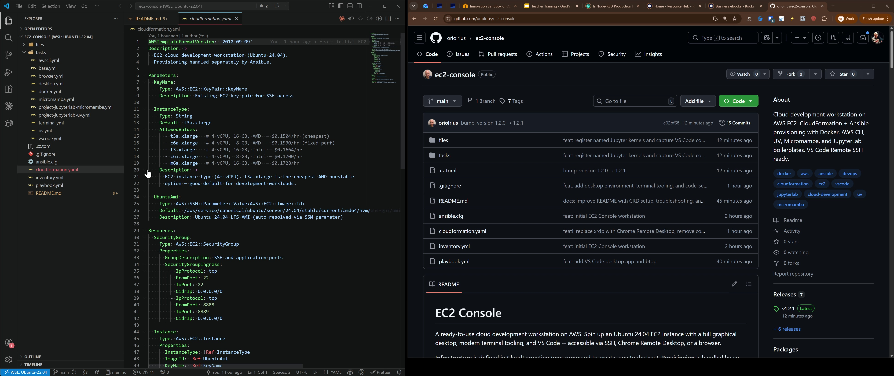

# EC2 Console

A ready-to-use cloud development workstation on AWS. Spin up an Ubuntu 24.04 EC2 instance with a full graphical desktop, modern terminal tooling, and VS Code -- accessible via SSH, Chrome Remote Desktop, or a browser.

**Infrastructure** is defined in CloudFormation (one command to create, one to destroy). **Provisioning** is handled by an idempotent Ansible playbook with modular, tagged task files.

[](https://youtu.be/hT7XWxzp-n0)
> **[Watch the full demo on YouTube](https://youtu.be/hT7XWxzp-n0)** -- deployment, provisioning, and usage walkthrough (click the image above)

## Access methods

| Method                          | Port        | Use case                                                                       |
| ------------------------------- | ----------- | ------------------------------------------------------------------------------ |
| **SSH**                   | 22          | Terminal access                                                                |
| **VS Code Remote SSH**    | 22          | Full IDE experience with remote file editing, debugging, and Jupyter notebooks |
| **Chrome Remote Desktop** | --          | Full XFCE graphical desktop (no inbound port -- uses Google's relay)           |
| **JupyterLab**            | 8888 / 8889 | Notebook interface (UV or Micromamba)                                          |

## Included tooling

| Tool                                              | Tag            | Purpose                                      |
| ------------------------------------------------- | -------------- | -------------------------------------------- |
| **AWS CLI v2**                              | `awscli`     | Interact with AWS services from the instance |
| **Docker CE + Compose v2**                  | `docker`     | Build and run containerized workloads        |
| **kubectl + Helm + eksctl + kind**          | `kubernetes` | K8s CLI, chart manager, EKS provisioner, local clusters |
| **UV**                                      | `uv`         | Fast Python package manager                  |
| **Micromamba**                              | `micromamba` | Conda-compatible environment manager         |
| **XFCE4 + Chrome Remote Desktop**           | `desktop`    | Graphical desktop via Google CRD             |
| **Kitty**                                   | `terminal`   | Terminal with native Nerd Font support       |
| **oh-my-posh**                              | `terminal`   | Modern shell prompt with glyphs              |
| **Zellij**                                  | `terminal`   | Terminal multiplexer                         |
| **Nerd Fonts**                              | `terminal`   | JetBrainsMono + Symbols fallback             |
| **VS Code**                                 | `vscode`     | Code editor with Python/Jupyter extensions   |
| **Google Chrome**                           | `browser`    | Web browser for desktop sessions             |

## Boilerplate projects

Two example projects under `/home/ubuntu/` demonstrate different Python environment approaches:

| Project                 | Path             | Manager                 | Port |
| ----------------------- | ---------------- | ----------------------- | ---- |
| JupyterLab (UV)         | `~/jupyterlab` | UV +`pyproject.toml`  | 8888 |
| JupyterLab (Micromamba) | `~/micromamba` | Micromamba +`env.yml` | 8889 |

Both include `start.sh`, a hello-world notebook, and `.vscode/settings.json` for automatic kernel selection.

## Prerequisites

- **AWS CLI** configured with valid credentials — install: [Windows](https://docs.aws.amazon.com/cli/latest/userguide/install-cliv2-windows.html) | [macOS](https://docs.aws.amazon.com/cli/latest/userguide/install-cliv2-mac.html) | [Linux](https://docs.aws.amazon.com/cli/latest/userguide/install-cliv2-linux.html)
- **UV** installed locally — install: [Windows / macOS / Linux](https://docs.astral.sh/uv/getting-started/installation/)

## Deploy

### 1. Create the key pair (first time only)

```bash
aws ec2 create-key-pair \
  --key-name ec2-key \
  --region eu-west-1 \
  --query 'KeyMaterial' \
  --output text > ec2-key.pem
chmod 600 ec2-key.pem
```

### 2. Launch the instance

```bash
aws cloudformation create-stack \
  --stack-name ec2-console \
  --template-body file://cloudformation.yaml \
  --parameters ParameterKey=KeyName,ParameterValue=ec2-key \
  --region eu-west-1

# Wait and get the IP
aws cloudformation wait stack-create-complete \
  --stack-name ec2-console --region eu-west-1

aws cloudformation describe-stacks \
  --stack-name ec2-console --region eu-west-1 \
  --query 'Stacks[0].Outputs[?OutputKey==`PublicIP`].OutputValue' \
  --output text
```

### 3. Provision with Ansible

```bash
uv sync
JUPYTER_IP=<public-ip> uv run ansible-playbook playbook.yml
```

This installs everything. To run only specific components, use tags:

```bash
JUPYTER_IP=<public-ip> uv run ansible-playbook playbook.yml --tags "docker,desktop"
```

<details>
<summary>Available tags</summary>

| Tag                       | What it provisions                                   |
| ------------------------- | ---------------------------------------------------- |
| `base`                  | System update + common packages (always runs)        |
| `awscli`                | AWS CLI v2                                           |
| `docker`                | Docker CE + Compose plugin + ubuntu group membership |
| `kubernetes`            | kubectl, Helm, eksctl, kind                          |
| `uv`                    | UV package manager                                   |
| `micromamba`            | Micromamba package manager                           |
| `desktop`               | XFCE4 desktop + Chrome Remote Desktop                |
| `terminal`              | Kitty, Nerd Fonts, oh-my-posh, Zellij                |
| `vscode`                | VS Code + Python/Jupyter extensions                  |
| `browser`               | Google Chrome                                        |
| `projects`              | All boilerplate projects                             |
| `jupyterlab-uv`         | JupyterLab UV project only                           |
| `jupyterlab-micromamba` | JupyterLab Micromamba project only                   |

</details>

The playbook is idempotent. Re-run it any time to apply updates or fix drift.

### 4. Connect

**SSH:**

```bash
ssh -i ec2-key.pem ubuntu@<public-ip>
```

**Chrome Remote Desktop (one-time setup per instance):**

1. SSH into the instance
2. On your local browser, go to https://remotedesktop.google.com/headless
3. Click **Set up via SSH** > **Begin** > **Next** > **Authorize**
4. Select **Debian Linux**, copy the `DISPLAY= /opt/google/chrome-remote-desktop/start-host ...` command
5. Paste and run on the SSH session, set a 6-digit PIN when prompted
6. **Reboot the instance** -- this is required for CRD to start cleanly:
   ```bash
   sudo reboot
   ```
7. After ~30 seconds, the instance appears as online at https://remotedesktop.google.com

CRD uses Google's relay so no inbound port is needed. The XFCE desktop starts automatically with Kitty as the default terminal, Nerd Fonts, and oh-my-posh.

**Troubleshooting CRD:**

```bash
# Check service status
sudo systemctl status chrome-remote-desktop@ubuntu

# Restart CRD
sudo systemctl restart chrome-remote-desktop@ubuntu

# If CRD shows "disabled" in the web UI, clean restart:
sudo systemctl stop chrome-remote-desktop@ubuntu
rm -rf /tmp/chrome_remote_desktop_*
sudo systemctl start chrome-remote-desktop@ubuntu

# If still disabled after clean restart, reboot:
sudo reboot
```

**JupyterLab:**

```bash
# SSH in, then:
cd ~/jupyterlab && ./start.sh    # http://<public-ip>:8888
cd ~/micromamba && ./start.sh     # http://<public-ip>:8889
```

## VS Code Remote SSH

The recommended IDE workflow: install [VS Code](https://code.visualstudio.com/) locally with the [Remote - SSH](https://marketplace.visualstudio.com/items?itemName=ms-vscode-remote.remote-ssh) extension, then connect to the instance. You get the full VS Code experience (editor, terminal, debugging, extensions, Jupyter notebooks) with all computation running on the EC2 instance.

### SSH config

**Windows** (`C:\Users\<user>\.ssh\config`):

```
Host ec2-console
    HostName <public-ip>
    User ubuntu
    IdentityFile C:\Users\<user>\.ssh\ec2-key.pem
```

Copy the key to your Windows `.ssh` folder and lock down permissions (PowerShell):

```powershell
Copy-Item ec2-key.pem C:\Users\<user>\.ssh\ec2-key.pem
icacls C:\Users\<user>\.ssh\ec2-key.pem /inheritance:r /grant:r "<user>:(R)"
```

**Linux / macOS** (`~/.ssh/config`):

```
Host ec2-console
    HostName <public-ip>
    User ubuntu
    IdentityFile ~/.ssh/ec2-key.pem
```

### Usage

1. `Ctrl+Shift+P` > **Remote-SSH: Connect to Host** > `ec2-console`
2. **File > Open Folder** > pick any project under `/home/ubuntu/`
3. Open a `.ipynb` file -- the Python kernel auto-selects from `.vscode/settings.json`

When the EC2 IP changes after a new deployment, update the `HostName` line in your SSH config. Everything else stays the same.

### Recommended VS Code extensions (installed on remote)

- **Python** -- language support, linting, debugging
- **Jupyter** -- notebook editing and kernel management
- **Docker** -- container management from the sidebar
- **Remote - SSH** -- already needed for the connection

## Tear down

```bash
aws cloudformation delete-stack \
  --stack-name ec2-console --region eu-west-1
```

This destroys the instance, security group, and EBS volume. The key pair persists in AWS until you delete it separately. The CRD registration is also invalidated when the instance is destroyed.

## Project structure

```
.
├── cloudformation.yaml                         # EC2 + security group
├── playbook.yml                                # Main playbook (imports tasks/)
├── ansible.cfg
├── inventory.yml
├── tasks/
│   ├── base.yml                                # System packages
│   ├── awscli.yml                              # AWS CLI v2
│   ├── docker.yml                              # Docker CE + Compose
│   ├── kubernetes.yml                          # kubectl, Helm, eksctl, kind
│   ├── uv.yml                                  # UV package manager
│   ├── micromamba.yml                           # Micromamba
│   ├── desktop.yml                             # XFCE4 + Chrome Remote Desktop
│   ├── terminal.yml                            # Kitty, Nerd Fonts, oh-my-posh, Zellij
│   ├── vscode.yml                              # VS Code + extensions
│   ├── browser.yml                             # Google Chrome
│   ├── project-jupyterlab-uv.yml               # JupyterLab + UV boilerplate
│   └── project-jupyterlab-micromamba.yml        # JupyterLab + Micromamba boilerplate
├── files/
│   ├── desktop/
│   │   └── xsession                           # CRD session startup (XFCE)
│   ├── terminal/
│   │   ├── kitty.conf                          # Kitty terminal config
│   │   ├── zellij-config.kdl                   # Zellij config
│   │   └── 10-nerd-font-symbols.conf           # Nerd Font fallback
│   ├── vscode/
│   │   ├── settings.json                       # VS Code user settings
│   │   └── extensions.txt                      # Extensions to install
│   ├── jupyterlab/                             # UV JupyterLab boilerplate
│   └── micromamba/                             # Micromamba JupyterLab boilerplate
└── .gitignore
```

## Instance types (eu-west-1, on-demand)

| Instance             | CPU               | vCPU | RAM   | $/hr    |
| -------------------- | ----------------- | ---- | ----- | ------- |
| **t3a.xlarge** | AMD (burstable)   | 4    | 16 GB | $0.1504 |
| c6a.xlarge           | AMD (fixed)       | 4    | 8 GB  | $0.1530 |
| t3.xlarge            | Intel (burstable) | 4    | 16 GB | $0.1664 |
| c6i.xlarge           | Intel (fixed)     | 4    | 8 GB  | $0.1700 |
| m6a.xlarge           | AMD (general)     | 4    | 16 GB | $0.1728 |

Override: `--parameters ParameterKey=InstanceType,ParameterValue=c6a.xlarge`

## Extending

Create a task file in `tasks/`, import it in `playbook.yml` with a tag. Add config files under `files/`. The playbook is the single source of truth for what gets installed.

## Notes

- The security group opens ports **22** (SSH) and **8888-8889** (JupyterLab) to `0.0.0.0/0`. Chrome Remote Desktop uses outbound connections only -- no inbound port needed. Restrict the CIDR in `cloudformation.yaml` for tighter access control.
- CRD registration is a **one-time manual step** per instance (requires a Google account). After registration, **reboot the instance** for CRD to start cleanly on boot.
- Stale CRD temp files (`/tmp/chrome_remote_desktop_*`) can prevent the host from connecting. Remove them and restart the service if CRD shows as disabled.
- The instance uses a **25 GB gp3** root volume. Increase `VolumeSize` in `cloudformation.yaml` if needed.
- If the AWS account has no default VPC: `aws ec2 create-default-vpc --region eu-west-1`.

## License

MIT
