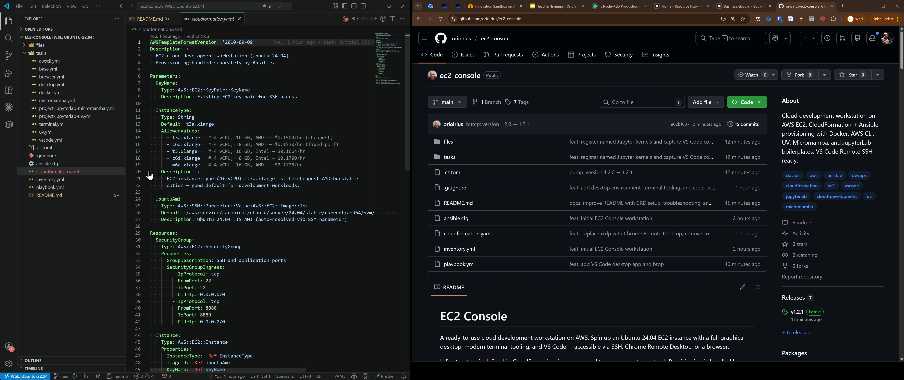

# EC2 Console

A ready-to-use cloud development workstation on AWS. Spin up an Ubuntu 24.04 EC2 instance with a full graphical desktop, modern terminal tooling, and VS Code -- accessible via SSH, Chrome Remote Desktop, or a browser.

**Infrastructure** is defined in CloudFormation or, equivalently, Terraform (one command to create, one to destroy). **Provisioning** is handled by an idempotent Ansible playbook with modular, tagged task files.

> **DBAI course users:** there is a separate, Terraform-based course path under [`dbai/`](dbai/README.md) (controller CLI, phase profiles, per-student state). It is unrelated to [`terraform/`](terraform/main.tf), which is the plain Terraform equivalent of `cloudformation.yaml` used with this Ansible playbook.

[](https://youtu.be/hT7XWxzp-n0)
> **[Watch the full demo on YouTube](https://youtu.be/hT7XWxzp-n0)** -- deployment, provisioning, and usage walkthrough (click the image above)

## Access methods

| Method                          | Port        | Use case                                                                       |
| ------------------------------- | ----------- | ------------------------------------------------------------------------------ |
| **SSH**                   | 22          | Terminal access                                                                |
| **VS Code Remote SSH**    | 22          | Full IDE experience with remote file editing, debugging, and Jupyter notebooks |
| **Chrome Remote Desktop** | --          | Full XFCE graphical desktop (no inbound port -- uses Google's relay)           |
| **JupyterLab**            | 8888 / 8889 | Notebook interface (UV or Micromamba)                                          |

## Included tooling

| Tool                                              | Tag            | Purpose                                      |
| ------------------------------------------------- | -------------- | -------------------------------------------- |
| **AWS CLI v2**                              | `awscli`     | Interact with AWS services from the instance |
| **Docker CE + Compose v2**                  | `docker`     | Build and run containerized workloads        |
| **kubectl + Helm + eksctl + kind**          | `kubernetes` | K8s CLI, chart manager, EKS provisioner, local clusters |
| **UV**                                      | `uv`         | Fast Python package manager                  |
| **Micromamba**                              | `micromamba` | Conda-compatible environment manager         |
| **XFCE4 + Chrome Remote Desktop**           | `desktop`    | Graphical desktop via Google CRD             |
| **CRD session recorder + CRD Recorder app** | `recorder`   | Records the CRD desktop to `~/recordings/`; tray app to control and upload |
| **Kitty**                                   | `terminal`   | Terminal with native Nerd Font support       |
| **oh-my-posh**                              | `terminal`   | Modern shell prompt with glyphs              |
| **Zellij**                                  | `terminal`   | Terminal multiplexer                         |
| **herdr**                                   | `terminal`   | Runtime for coding agents                    |
| **Nerd Fonts**                              | `terminal`   | JetBrainsMono + Symbols fallback             |
| **VS Code**                                 | `vscode`     | Code editor with Python/Jupyter extensions   |
| **Google Chrome**                           | `browser`    | Web browser for desktop sessions             |

## Boilerplate projects

Two example projects under `/home/ubuntu/` demonstrate different Python environment approaches:

| Project                 | Path             | Manager                 | Port |
| ----------------------- | ---------------- | ----------------------- | ---- |
| JupyterLab (UV)         | `~/jupyterlab` | UV +`pyproject.toml`  | 8888 |
| JupyterLab (Micromamba) | `~/micromamba` | Micromamba +`env.yml` | 8889 |

Both include `start.sh`, a hello-world notebook, and `.vscode/settings.json` for automatic kernel selection.

## Getting started

Pick one of the two step-by-step runbooks. Both create the same machine and then provision it with the same Ansible playbook, including the Chrome Remote Desktop setup:

| Runbook | Infrastructure | Use it when |
| ------- | -------------- | ----------- |
| [docs/RUNBOOK-terraform.md](docs/RUNBOOK-terraform.md) | [`terraform/`](terraform/main.tf) | Recommended. Creates its own VPC, so it works in any account. |
| [docs/RUNBOOK-cloudformation.md](docs/RUNBOOK-cloudformation.md) | [`cloudformation.yaml`](cloudformation.yaml) | No Terraform installed. Needs a default VPC. |

## Ansible tags

The runbooks install everything. To (re)install only some components, pass tags. The host IP is found automatically by [`scripts/host-ip.sh`](scripts/host-ip.sh) (Terraform output, else the `ec2-console` CloudFormation stack); set `JUPYTER_IP=<public-ip>` to target another machine.

```bash
uv run ansible-playbook playbook.yml --tags "docker,desktop"
```

| Tag                       | What it provisions                                   |
| ------------------------- | ---------------------------------------------------- |
| `base`                  | System update + common packages (always runs)        |
| `awscli`                | AWS CLI v2                                           |
| `docker`                | Docker CE + Compose plugin + ubuntu group membership |
| `kubernetes`            | kubectl, Helm, eksctl, kind                          |
| `uv`                    | UV package manager                                   |
| `micromamba`            | Micromamba package manager                           |
| `desktop`               | XFCE4 desktop + Chrome Remote Desktop                |
| `recorder`              | CRD session recorder + CRD Recorder app (needs `desktop`) |
| `terminal`              | Kitty, Nerd Fonts, oh-my-posh, Zellij, herdr         |
| `vscode`                | VS Code + Python/Jupyter extensions                  |
| `browser`               | Google Chrome                                        |
| `projects`              | All boilerplate projects                             |
| `jupyterlab-uv`         | JupyterLab UV project only                           |
| `jupyterlab-micromamba` | JupyterLab Micromamba project only                   |

The playbook is idempotent. Re-run it any time to apply updates or fix drift.

## Session recording

The `recorder` component records the Chrome Remote Desktop desktop on the instance itself, and installs **CRD Recorder**, a small tray app to watch and control it and to upload the recordings.

**Recording** (`crd-recorder.service`, systemd):

- ffmpeg `x11grab` at **1 frame per second** (playback runs in real time), with the **UTC date/time** in the top-left corner, H.264 in MKV. Files are named after the UTC time they start (`~/recordings/crd_2026-09-30T14-00-00Z.mkv`) and are cut on every full UTC hour; a new file also starts whenever the recorder (re)starts.
- The unit starts and stops together with `chrome-remote-desktop@ubuntu` (`WantedBy=`, `PartOf=`). On stop, systemd signals the wrapper, which asks ffmpeg to finalize the file (one SIGINT) and waits for it, before CRD removes the desktop.
- The wrapper `/usr/local/bin/crd-recorder` only handles the X session. It waits for CRD's X display (found from the Xorg process CRD started, not assumed to be `:20`). It ends the current file when the desktop is resized or the session ends (e.g. XFCE logout), and systemd starts it again 5 s later. systemd also restarts it if ffmpeg crashes.
- Settings: `/etc/default/crd-recorder` (`CRD_RECORDER_DIR`, `CRD_RECORDER_FPS`, `CRD_RECORDER_SEGMENT_SECONDS`), then `sudo systemctl restart crd-recorder`. Ansible variables of the same names (`crd_recorder_*` in [`playbook.yml`](playbook.yml)) set them.
- Logs: `journalctl -u crd-recorder`.
- CRD keeps the virtual desktop running after the client disconnects, so recording continues until the session ends. A mostly static desktop takes little space, but nothing is rotated: clean up `~/recordings/` on long-lived instances.

**CRD Recorder app** (`crd-recorder-gui`, Go + GTK 3, source in [`crd-recorder-gui/`](crd-recorder-gui/)):

- Starts hidden in the system tray with every XFCE session. The tray icon shows the recorder state: red dot = recording, grey ring = stopped, amber = waiting for the CRD session, blue = restarting, red ring = error. It is also in the dock and the Applications menu.
- Clicking the tray or dock icon shows the window. Closing the window keeps the app in the tray. There is only ever one instance; launching it again brings the running window forward.
- **Start/Stop recording** runs `systemctl enable|disable --now crd-recorder` through `sudo -n`. `/etc/sudoers.d/crd-recorder` allows exactly these two commands without a password, so the app does not depend on the blanket passwordless sudo that EC2 images give `ubuntu`. The choice persists: re-running the playbook enables recording only on the first install (`crd_recorder_enabled`).
- **Upload** sends finished recordings to a Transfer.sh-compatible server (default `https://x.joor.net`), oldest first, and lists the returned URLs with a Copy button. The file ffmpeg is still writing is never uploaded (no process may have the file open, and it must be unchanged for 10 s). A failed upload stays pending for the next run.
- The log view shows the recorder's journal next to the app's own events.
- Settings (email, Transfer URL) are in `~/.config/crd-recorder-gui/config.json`, and what was uploaded in `state.json`.

The app binary comes from this repository's GitHub releases: CI ([`crd-recorder-gui.yml`](.github/workflows/crd-recorder-gui.yml)) builds it on every `v*` tag. `crd_recorder_gui_version` (default `latest`) selects the release; `-e crd_recorder_gui_src=path/to/binary` installs a local build instead. If the release has no binary, the playbook warns and continues without the app. To build it yourself, run `cd crd-recorder-gui && go build .` (needs `libgtk-3-dev`).

To test the recorder without registering a machine with Google, [`tests/crd-sim/`](tests/crd-sim/) has a stand-in for CRD's session handling.

## Keyboard layout

The Chrome Remote Desktop session starts with the layout in `keyboard_layout` (default `us`; any `setxkbmap` layout name). Set it to match **your** keyboard, or keys such as `ñ`, `@` and accents come out wrong:

```bash
uv run ansible-playbook playbook.yml -e keyboard_layout=es            # full install
uv run ansible-playbook playbook.yml --tags desktop -e keyboard_layout=es   # change it later
```

The new layout applies from the next CRD session. To switch the current session right away, run `setxkbmap es` in a terminal inside the desktop.

## Troubleshooting Chrome Remote Desktop

The runbooks cover the one-time setup. If the host stays offline or shows "disabled":

```bash
sudo systemctl status chrome-remote-desktop@ubuntu    # check the service
sudo systemctl stop chrome-remote-desktop@ubuntu      # clean restart
rm -rf /tmp/chrome_remote_desktop_*
sudo systemctl start chrome-remote-desktop@ubuntu
sudo reboot                                           # if still disabled
```

## Using the machine

**JupyterLab:**

```bash
# SSH in, then:
cd ~/jupyterlab && ./start.sh    # http://<public-ip>:8888
cd ~/micromamba && ./start.sh     # http://<public-ip>:8889
```

## VS Code Remote SSH

The recommended IDE workflow: install [VS Code](https://code.visualstudio.com/) locally with the [Remote - SSH](https://marketplace.visualstudio.com/items?itemName=ms-vscode-remote.remote-ssh) extension, then connect to the instance. You get the full VS Code experience (editor, terminal, debugging, extensions, Jupyter notebooks) with all computation running on the EC2 instance.

### SSH config

**Windows** (`C:\Users\<user>\.ssh\config`):

```
Host ec2-console
    HostName <public-ip>
    User ubuntu
    IdentityFile C:\Users\<user>\.ssh\ec2-key.pem
```

Copy the key to your Windows `.ssh` folder and lock down permissions (PowerShell):

```powershell
Copy-Item ec2-key.pem C:\Users\<user>\.ssh\ec2-key.pem
icacls C:\Users\<user>\.ssh\ec2-key.pem /inheritance:r /grant:r "<user>:(R)"
```

**Linux / macOS** (`~/.ssh/config`):

```
Host ec2-console
    HostName <public-ip>
    User ubuntu
    IdentityFile ~/.ssh/ec2-key.pem
```

### Usage

1. `Ctrl+Shift+P` > **Remote-SSH: Connect to Host** > `ec2-console`
2. **File > Open Folder** > pick any project under `/home/ubuntu/`
3. Open a `.ipynb` file -- the Python kernel auto-selects from `.vscode/settings.json`

When the EC2 IP changes after a new deployment, update the `HostName` line in your SSH config. Everything else stays the same.

### VS Code extensions (installed on the instance)

From `files/vscode/extensions.txt`:

- **Python**, **Pylance**, **Python Environments**, **Python Debugger** -- language support, linting, debugging
- **Jupyter** (with keymap, renderers, cell tags, slideshow) -- notebook editing and kernel management
- **uv-toolkit** -- UV project support

**Remote - SSH** is installed on your local VS Code, not on the instance.

## Project structure

```
.
├── cloudformation.yaml                         # EC2 + security group
├── terraform/main.tf                           # Terraform equivalent (+ minimal VPC)
├── docs/RUNBOOK-terraform.md                   # Step-by-step guide: Terraform + Ansible + CRD
├── docs/RUNBOOK-cloudformation.md              # Step-by-step guide: CloudFormation + Ansible + CRD
├── dbai/                                       # Separate DBAI course path (see dbai/README.md)
├── playbook.yml                                # Main playbook (imports tasks/)
├── ansible.cfg
├── inventory.yml                               # Host IP via scripts/host-ip.sh
├── scripts/host-ip.sh                          # JUPYTER_IP, else Terraform output, else CF stack
├── tasks/
│   ├── base.yml                                # System packages
│   ├── awscli.yml                              # AWS CLI v2
│   ├── docker.yml                              # Docker CE + Compose
│   ├── kubernetes.yml                          # kubectl, Helm, eksctl, kind
│   ├── uv.yml                                  # UV package manager
│   ├── micromamba.yml                           # Micromamba
│   ├── desktop.yml                             # XFCE4 + Chrome Remote Desktop
│   ├── terminal.yml                            # Kitty, Nerd Fonts, oh-my-posh, Zellij, herdr
│   ├── vscode.yml                              # VS Code + extensions
│   ├── browser.yml                             # Google Chrome
│   ├── project-jupyterlab-uv.yml               # JupyterLab + UV boilerplate
│   └── project-jupyterlab-micromamba.yml        # JupyterLab + Micromamba boilerplate
├── files/
│   ├── desktop/
│   │   └── xfconf/                             # XFCE panel + power manager config
│   ├── terminal/
│   │   ├── kitty.conf                          # Kitty terminal config
│   │   ├── zellij-config.kdl                   # Zellij config
│   │   └── 10-nerd-font-symbols.conf           # Nerd Font fallback
│   ├── vscode/
│   │   ├── settings.json                       # VS Code user settings
│   │   └── extensions.txt                      # Extensions to install
│   ├── jupyterlab/                             # UV JupyterLab boilerplate
│   └── micromamba/                             # Micromamba JupyterLab boilerplate
└── .gitignore
```

## Instance types (eu-west-1, on-demand)

| Instance             | CPU               | vCPU | RAM   | $/hr    | $/month (24/7) |
| -------------------- | ----------------- | ---- | ----- | ------- | -------------- |
| **t3a.xlarge** | AMD (burstable)   | 4    | 16 GB | $0.1632 | $119.14        |
| c6a.xlarge           | AMD (fixed)       | 4    | 8 GB  | $0.1642 | $119.84        |
| t3.xlarge            | Intel (burstable) | 4    | 16 GB | $0.1824 | $133.15        |
| c6i.xlarge           | Intel (fixed)     | 4    | 8 GB  | $0.1824 | $133.15        |
| m6a.xlarge           | AMD (general)     | 4    | 16 GB | $0.1926 | $140.60        |

Prices from the AWS Pricing API (September 2026), Linux, shared tenancy. The monthly figure is 730 hours. A stopped instance costs nothing for compute, but the 25 GB gp3 disk always adds about **$2.20/month** until the machine is deleted.

Override: `terraform -chdir=terraform apply -var instance_type=c6a.xlarge` (Terraform) or add `ParameterKey=InstanceType,ParameterValue=c6a.xlarge` to `--parameters` (CloudFormation).

## Extending

Create a task file in `tasks/`, import it in `playbook.yml` with a tag. Add config files under `files/`. The playbook is the single source of truth for what gets installed.

## Notes

- The security group opens ports **22** (SSH) and **8888-8889** (JupyterLab) to `0.0.0.0/0`. Chrome Remote Desktop uses outbound connections only -- no inbound port needed. Restrict the CIDR in `terraform/main.tf` / `cloudformation.yaml` for tighter access control.
- The instance uses a **25 GB gp3** root volume. Increase `volume_size` in `terraform/main.tf` / `VolumeSize` in `cloudformation.yaml` if needed.

## License

MIT
